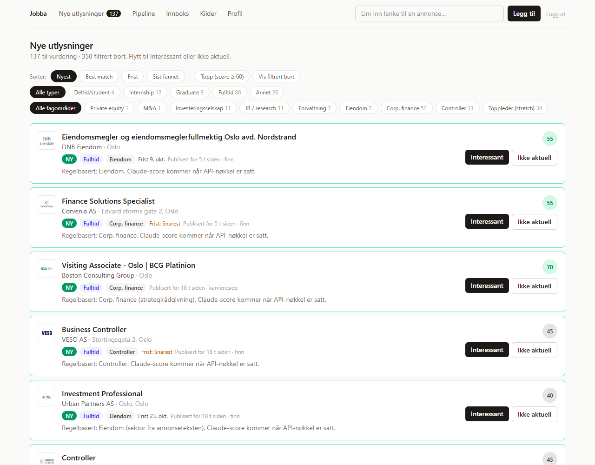

# Jobba

A personal job-search pipeline. Jobba collects new job ads from Norwegian job boards and company career sites. It scores them against a written profile and follows each application from "new ad" to the final answer, including replies in the inbox.

I built it for my own search for student jobs, internships and graduate roles in finance (venture capital, private equity, M&A, analyst roles). The goal is to find a relevant ad within minutes of it being published and apply the same day. The interface is in Norwegian.



## What it does

- **Nye utlysninger (new ads).** Every 15 minutes during the day it checks the newest results of each source, and once a night it runs a full sweep. Each ad is stored with company, full text, street address, deadline, contact person and when it was published or last changed.
  - Filter by job type and sector.
  - Sort by newest, best match, deadline, or when Jobba found it.
  - Anything published in the last 24 hours is marked **NY**.
- **Scoring.** A rule-based classifier gives every ad a job type, sector and rough score as soon as it's stored, so filtering works without any API. Claude (Haiku) then re-scores new ads in batches against the free-text profile on `/profil`. Low scores are hidden but kept.
- **Snipe alerts.** When a strong match appears (score ≥ 70), an e-mail goes out right away with the contact's phone number, so you can call and apply the same day.
- **Pipeline.** Interessant → Under arbeid → Sendt → Intervju → Tilbud/Avslag, with next step and date, notes, and a timeline per job. Marking a job as sent schedules a follow-up call 10 days later.
- **Inbox.** It reads the mailbox over IMAP in read-only mode. Claude classifies replies (confirmation, interview, rejection, offer) and links each to its application. Suggested status changes wait for one click; nothing changes silently.
- **LinkedIn.** LinkedIn job-alert e-mails in the inbox are turned into jobs. LinkedIn itself is not scraped (see below).
- **Daily digest** of new matches, deadlines this week and follow-ups due.
- **`npm run hent -- <id>`** writes the ad to a local application folder as `utlysning.md`, for writing the cover letter there.

## Sources

| Source | How | Notes |
|---|---|---|
| finn.no | Search page → ad pages. Each ad carries `JobPosting` JSON-LD; the deadline text ("Snarest"), contact box and "Sist endret" are read from the page | Snipe runs sort by `PUBLISHED_DESC` |
| arbeidsplassen.nav.no | Semantic search; the ad is read from the Next.js flight payload embedded in the page (`self.__next_f`) | NAV copies of finn ads are mapped back to the finn URL, so they deduplicate |
| Teamtailor career sites | `/jobs.rss`, which has full text and office address | Ferd, Pareto Securities, ABG Sundal Collier, Altor |
| Webcruiter | The same company-search API the public job list calls | NBIM |
| Phenom career sites | `phApp.ddo` search data → job pages with JSON-LD | BCG |
| Any other career page | Links matching a regex → JSON-LD, or Claude extracts the ad from the page text | e.g. Finansavisen |
| LinkedIn | Job-alert e-mails via IMAP | LinkedIn's terms forbid scraping |
| Paste a link | Any URL, same JSON-LD / Claude fallback | |

On `/kilder`, paste any URL or search terms and the source type is detected automatically. karrierestart.no blocks automated requests (403); its ads can still be pasted as links.

Jobs deduplicate on URL and on normalised company + title, so an ad reposted under a new URL doesn't show up as new.

## Stack

- Next.js 16 (App Router, server actions, `proxy.ts`), React 19, Tailwind 4
- Prisma + PostgreSQL (Supabase in production, Docker locally)
- Anthropic API: Claude Haiku 4.5 for scoring and e-mail classification, Claude Sonnet 5 for the on-demand match analysis
- `imapflow` + `mailparser` for the inbox; Resend for outgoing e-mail
- Vercel for hosting, with a nightly Vercel cron and a 15-minute Supabase `pg_cron` job (`supabase/snipe-cron.sql`)
- Single-user login: scrypt password hash plus a signed JWT cookie (`jose`)
- Vitest, with parser tests against saved real pages in `tests/fixtures`

```
app/            pages (Nye utlysninger, pipeline, job, innboks, kilder, profil), server actions, cron route
lib/sources/    one adapter per source (finn, nav, teamtailor, webcruiter, phenom, career-page, linkedin)
lib/            classify (rules), ai (Claude), scrape, snipe, mail, digest, jobs (dedup + status)
scripts/        seed, importer, hent, reklassifiser, hash-password
```

## Running it

```bash
docker compose up -d                   # Postgres on port 5433
cp .env.example .env                   # fill in; see comments in the file
cp profile.example.md profile.local.md # describe yourself and what you want
npx prisma migrate dev
npm run seed                           # default sources + profile
npm run dev
```

Trigger a run by hand:

```bash
curl -H "Authorization: Bearer $CRON_SECRET" localhost:3000/api/cron/snipe   # quick: newest results + inbox + alert
curl -H "Authorization: Bearer $CRON_SECRET" localhost:3000/api/cron/daily   # full sweep + inbox + digest
```

Personal data never goes in the repo. `profile.local.md` (your profile) and `data/*.local.json` (applications for `npm run importer`, see `data/applications.example.json`) are gitignored. Everything else lives in the database.

### Deploying

1. Create a Supabase project. Put the transaction-pooler URL in `DATABASE_URL` (add `?pgbouncer=true`) and the session-pooler URL in `DIRECT_URL`.
2. Import the repo in Vercel and set the variables from `.env.example`. The build runs `prisma migrate deploy` itself.
3. Run `npm run seed -- --profil` once, locally, against the production database.
4. In Supabase, enable `pg_cron` and `pg_net` and run `supabase/snipe-cron.sql` with your URL and `CRON_SECRET`.
5. For LinkedIn: create job alerts with "Instant" delivery to the address Jobba reads.

## Tests

```bash
npm test
```

The tests cover the finn, NAV, Teamtailor, Webcruiter and Phenom parsers against real saved pages, LinkedIn alert parsing, the rule-based classifier (including false positives found in real data), password verification and the mail pre-filter.
